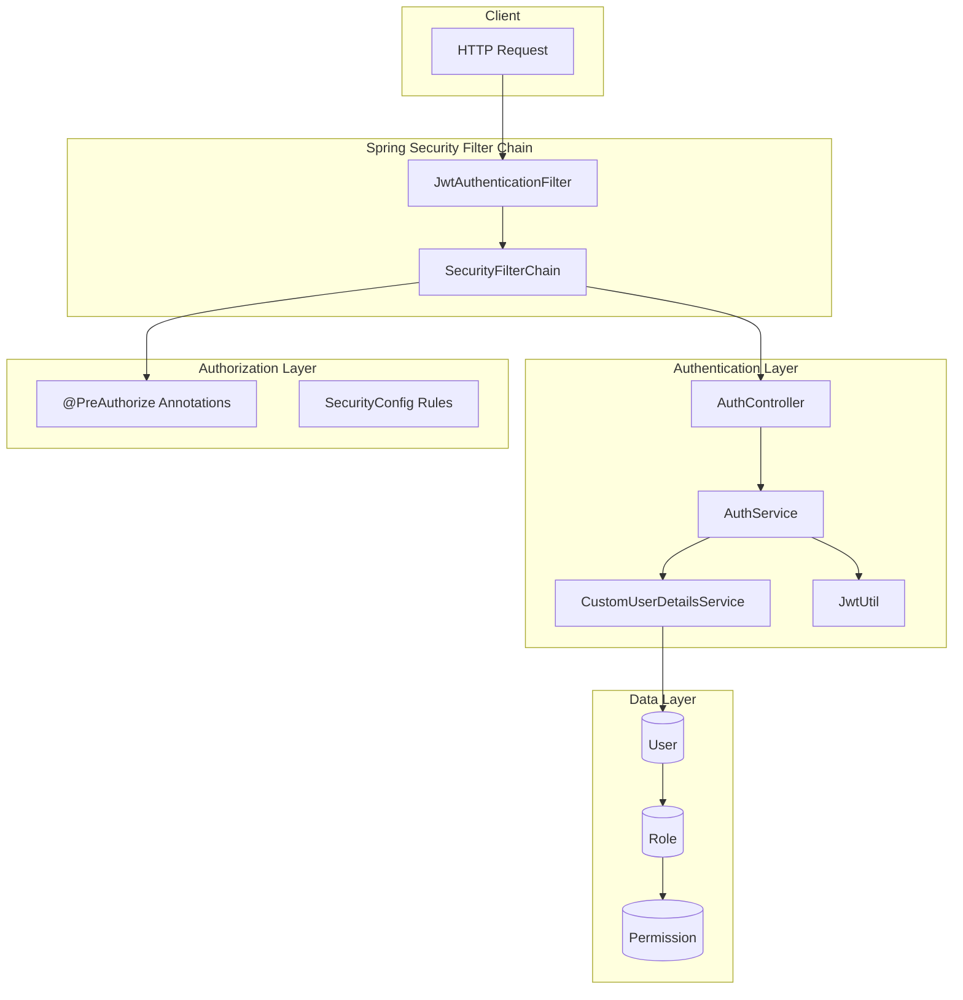
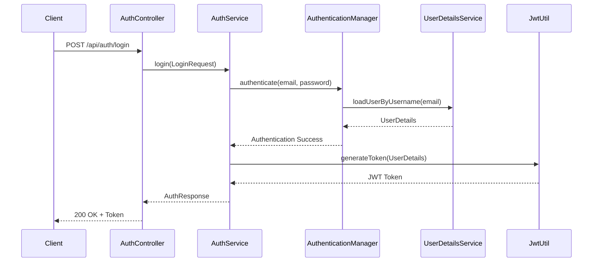
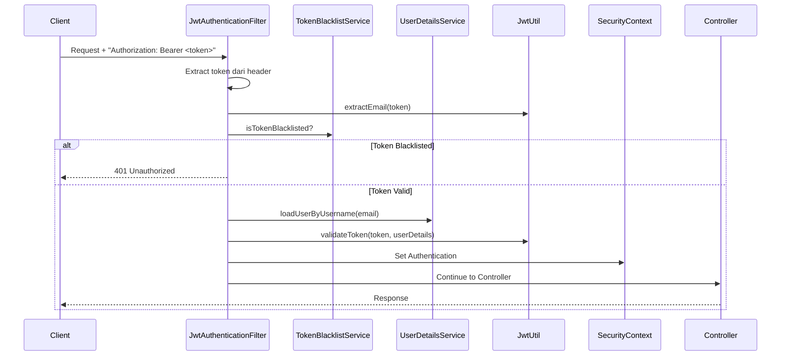
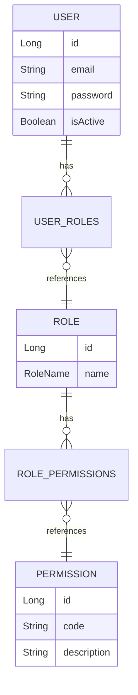
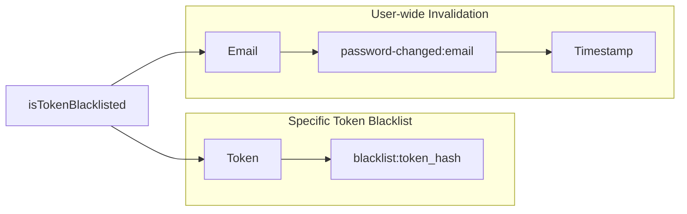
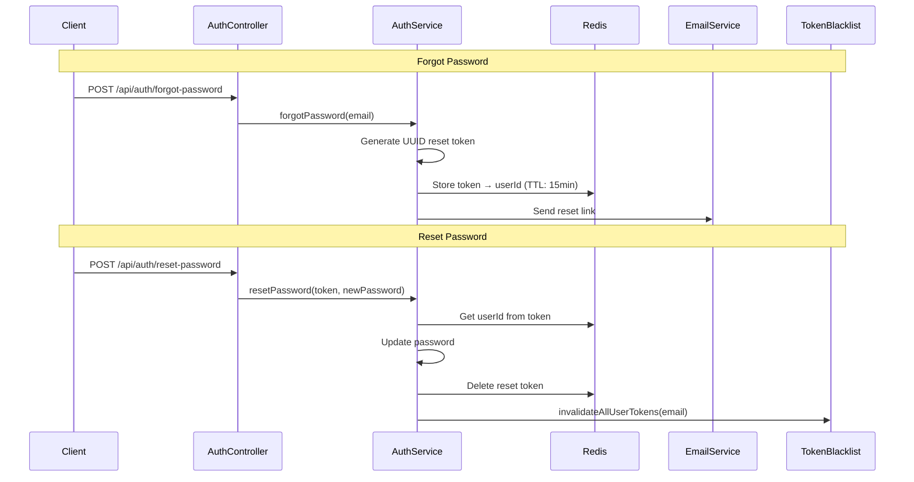
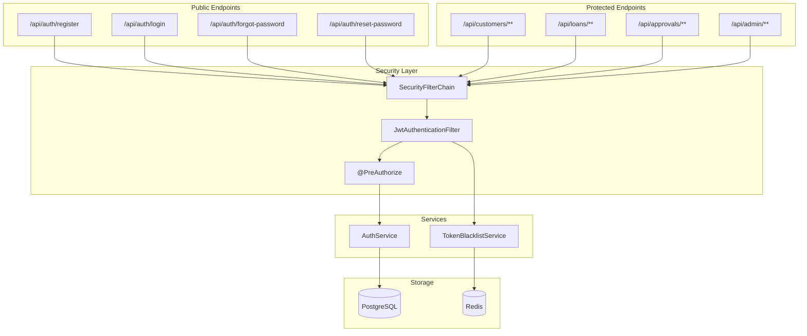

# Dokumentasi Autentikasi & Otorisasi

Dokumen ini menjelaskan secara lengkap sistem **autentikasi** (siapa kamu?) dan **otorisasi** (apa yang boleh kamu akses?) di aplikasi Binar Backend.

---

## Daftar Isi

1. [Arsitektur Keamanan](#arsitektur-keamanan)
2. [Alur Autentikasi (Login Flow)](#alur-autentikasi-login-flow)
3. [JWT (JSON Web Token)](#jwt-json-web-token)
4. [Alur Request dengan JWT](#alur-request-dengan-jwt)
5. [Role-Based Access Control (RBAC)](#role-based-access-control-rbac)
6. [Permission-Based Access Control](#permission-based-access-control)
7. [Token Blacklisting & Logout](#token-blacklisting--logout)
8. [Password Reset Flow](#password-reset-flow)
9. [Komponen & File Terkait](#komponen--file-terkait)

---

## Arsitektur Keamanan



---

## Alur Autentikasi (Login Flow)

### Langkah-langkah Login



### Implementasi di Project

#### 1. Controller Layer - [AuthController.java](file:///Users/given/IdeaProjects/binar-be/src/main/java/com/gvn/binarbe/controller/AuthController.java)

```java
@PostMapping("/login")
public ResponseEntity<ApiResponse<AuthResponse>> login(@Valid @RequestBody LoginRequest request) {
    AuthResponse response = authService.login(request);
    return ResponseUtil.ok("Login successful", response);
}
```

#### 2. Service Layer - [AuthServiceImpl.java](file:///Users/given/IdeaProjects/binar-be/src/main/java/com/gvn/binarbe/service/impl/AuthServiceImpl.java)

```java
@Override
public AuthResponse login(LoginRequest request) {
    // 1. Authenticate menggunakan Spring Security
    authenticationManager.authenticate(
        new UsernamePasswordAuthenticationToken(request.getEmail(), request.getPassword()));

    // 2. Ambil data user dari database
    User user = userRepository.findByEmailWithRoles(request.getEmail())
            .orElseThrow(() -> BusinessException.unauthorized("Invalid credentials"));

    // 3. Check if account is active
    if (!user.getIsActive()) {
        throw BusinessException.unauthorized("Account is disabled");
    }

    // 4. Generate JWT token
    UserDetails userDetails = userDetailsService.loadUserByUsername(user.getEmail());
    String token = jwtUtil.generateToken(userDetails);

    return buildAuthResponse(user, token);
}
```

---

## JWT (JSON Web Token)

JWT adalah token berformat standar yang berisi informasi user dan digunakan untuk memverifikasi identitas tanpa perlu query database setiap request.

### Struktur JWT

```
eyJhbGciOiJIUzI1NiJ9.eyJyb2xlcyI6WyJST0xFX0NVU1RPTUVSIiwiTE9BTl9DUkVBVEUiLC...
|----- HEADER -----|.|----- PAYLOAD ----|.|----- SIGNATURE -----|
```

### Konfigurasi JWT

Konfigurasi JWT ada di `application.yml`:

```yaml
jwt:
  secret: your-base64-encoded-secret-key
  expiration: 86400000 # 24 jam dalam milidetik
```

### JwtUtil - [JwtUtil.java](file:///Users/given/IdeaProjects/binar-be/src/main/java/com/gvn/binarbe/security/JwtUtil.java)

```java
@Component
public class JwtUtil {

    @Value("${jwt.secret}")
    private String secretKey;

    @Value("${jwt.expiration}")
    private long jwtExpiration;

    // Generate token dengan roles di dalam claims
    public String generateToken(UserDetails userDetails) {
        Map<String, Object> extraClaims = new HashMap<>();
        extraClaims.put("roles", userDetails.getAuthorities().stream()
                .map(GrantedAuthority::getAuthority)
                .collect(Collectors.toList()));
        return generateToken(extraClaims, userDetails);
    }

    public String generateToken(Map<String, Object> extraClaims, UserDetails userDetails) {
        return Jwts.builder()
                .claims(extraClaims)
                .subject(userDetails.getUsername())  // email
                .issuedAt(new Date())
                .expiration(new Date(System.currentTimeMillis() + jwtExpiration))
                .signWith(getSigningKey(), Jwts.SIG.HS256)
                .compact();
    }

    // Validate token
    public Boolean validateToken(String token, UserDetails userDetails) {
        final String email = extractEmail(token);
        return (email.equals(userDetails.getUsername()) && !isTokenExpired(token));
    }
}
```

---

## Alur Request dengan JWT

Setiap request ke protected endpoint melewati `JwtAuthenticationFilter`:



### JwtAuthenticationFilter - [JwtAuthenticationFilter.java](file:///Users/given/IdeaProjects/binar-be/src/main/java/com/gvn/binarbe/security/JwtAuthenticationFilter.java)

```java
@Slf4j
@Component
@RequiredArgsConstructor
public class JwtAuthenticationFilter extends OncePerRequestFilter {

    private final JwtUtil jwtUtil;
    private final UserDetailsService userDetailsService;
    private final TokenBlacklistService tokenBlacklistService;

    @Override
    protected void doFilterInternal(
            HttpServletRequest request,
            HttpServletResponse response,
            FilterChain filterChain) throws ServletException, IOException {

        // 1. Ambil header Authorization
        final String authHeader = request.getHeader("Authorization");

        // 2. Check format "Bearer <token>"
        if (authHeader == null || !authHeader.startsWith("Bearer ")) {
            filterChain.doFilter(request, response);
            return;
        }

        // 3. Extract token
        final String jwt = authHeader.substring(7);
        final String userEmail = jwtUtil.extractEmail(jwt);

        // 4. Check blacklist
        Date issuedAt = jwtUtil.extractIssuedAt(jwt);
        if (tokenBlacklistService.isTokenBlacklisted(jwt, userEmail, issuedAt.getTime())) {
            filterChain.doFilter(request, response);
            return;
        }

        // 5. Load user dan validate token
        UserDetails userDetails = userDetailsService.loadUserByUsername(userEmail);

        if (jwtUtil.validateToken(jwt, userDetails)) {
            // 6. Set authentication di SecurityContext
            UsernamePasswordAuthenticationToken authToken =
                new UsernamePasswordAuthenticationToken(
                    userDetails, null, userDetails.getAuthorities());
            SecurityContextHolder.getContext().setAuthentication(authToken);
        }

        filterChain.doFilter(request, response);
    }
}
```

---

## Role-Based Access Control (RBAC)

### Roles yang Tersedia

| Role             | Deskripsi                   | Branch Restriction |
| ---------------- | --------------------------- | ------------------ |
| `SUPERADMIN`     | Full system access          | ❌ Tidak           |
| `MARKETING`      | Proses pengajuan loan       | ✅ Ya              |
| `BRANCH_MANAGER` | Approve loan tingkat cabang | ✅ Ya              |
| `BACKOFFICE`     | Final approval              | ❌ Tidak           |
| `CUSTOMER`       | Akses customer              | ❌ Tidak           |

### Entity Relationship



### Role Entity - [Role.java](file:///Users/given/IdeaProjects/binar-be/src/main/java/com/gvn/binarbe/entity/Role.java)

```java
@Entity
@Table(name = "roles")
public class Role {
    @Id
    @GeneratedValue(strategy = GenerationType.IDENTITY)
    private Long id;

    @Enumerated(EnumType.STRING)
    @Column(nullable = false, unique = true)
    private RoleName name;

    @ManyToMany(fetch = FetchType.EAGER)
    @JoinTable(name = "roles_permissions",
        joinColumns = @JoinColumn(name = "role_id"),
        inverseJoinColumns = @JoinColumn(name = "permission_id"))
    private Set<Permission> permissions = new HashSet<>();
}
```

### SecurityConfig - [SecurityConfig.java](file:///Users/given/IdeaProjects/binar-be/src/main/java/com/gvn/binarbe/config/SecurityConfig.java)

```java
@Configuration
@EnableWebSecurity
@EnableMethodSecurity  // Enable @PreAuthorize
@RequiredArgsConstructor
public class SecurityConfig {

    @Bean
    public SecurityFilterChain securityFilterChain(HttpSecurity http) throws Exception {
        http
            .csrf(AbstractHttpConfigurer::disable)
            .authorizeHttpRequests(auth -> auth
                // Public endpoints
                .requestMatchers("/api/auth/**").permitAll()
                .requestMatchers(HttpMethod.GET, "/api/products/**").permitAll()
                .requestMatchers(HttpMethod.GET, "/api/branches/**").permitAll()

                // Admin endpoints - superadmin only
                .requestMatchers("/api/admin/**").hasRole("SUPERADMIN")

                // All other requests require authentication
                .anyRequest().authenticated())
            .sessionManagement(session -> session
                .sessionCreationPolicy(SessionCreationPolicy.STATELESS))
            .addFilterBefore(jwtAuthFilter, UsernamePasswordAuthenticationFilter.class);

        return http.build();
    }
}
```

---

## Permission-Based Access Control

Permissions memberikan kontrol akses yang lebih granular dibanding roles.

### Daftar Permissions

| Category     | Permission Code               | Deskripsi                      |
| ------------ | ----------------------------- | ------------------------------ |
| **User**     | `USER_READ`                   | Baca data user                 |
|              | `USER_CREATE`                 | Buat user baru                 |
|              | `USER_UPDATE`                 | Update user                    |
|              | `USER_DELETE`                 | Hapus user                     |
| **Role**     | `ROLE_READ`                   | Baca roles                     |
|              | `ROLE_ASSIGN`                 | Assign role ke user            |
|              | `ROLE_MANAGE`                 | Kelola permissions role        |
| **Loan**     | `LOAN_CREATE`                 | Buat pengajuan loan            |
|              | `LOAN_READ`                   | Baca loan sendiri              |
|              | `LOAN_READ_ALL`               | Baca semua loan                |
|              | `LOAN_READ_BRANCH`            | Baca loan per cabang           |
| **Approval** | `LOAN_APPROVE_MARKETING`      | Approve sebagai Marketing      |
|              | `LOAN_APPROVE_BRANCH_MANAGER` | Approve sebagai Branch Manager |
|              | `LOAN_APPROVE_BACKOFFICE`     | Final approval                 |
|              | `LOAN_REJECT`                 | Reject loan                    |
| **Profile**  | `PROFILE_READ`                | Baca profile sendiri           |
|              | `PROFILE_UPDATE`              | Update profile sendiri         |
| **Plafond**  | `PLAFOND_READ`                | Baca plafond sendiri           |
|              | `PLAFOND_SELECT`              | Pilih plafond                  |

### Mapping Roles → Permissions

```
SUPERADMIN  → ALL PERMISSIONS

MARKETING   → LOAN_READ_BRANCH, LOAN_APPROVE_MARKETING, LOAN_REJECT,
              PRODUCT_READ, BRANCH_READ

BRANCH_MANAGER → LOAN_READ_BRANCH, LOAN_APPROVE_BRANCH_MANAGER, LOAN_REJECT,
                 PRODUCT_READ, BRANCH_READ, USER_READ

BACKOFFICE  → LOAN_READ_ALL, LOAN_APPROVE_BACKOFFICE, LOAN_REJECT,
              PRODUCT_READ, BRANCH_READ

CUSTOMER    → LOAN_CREATE, LOAN_READ, PRODUCT_READ, BRANCH_READ,
              PROFILE_READ, PROFILE_UPDATE, PLAFOND_READ, PLAFOND_SELECT
```

### CustomUserDetailsService - [CustomUserDetailsService.java](file:///Users/given/IdeaProjects/binar-be/src/main/java/com/gvn/binarbe/security/CustomUserDetailsService.java)

Service ini membangun `GrantedAuthority` dari roles dan permissions:

```java
@Service
@RequiredArgsConstructor
public class CustomUserDetailsService implements UserDetailsService {

    @Override
    public UserDetails loadUserByUsername(String email) {
        User user = userRepository.findByEmailWithRoles(email)
                .orElseThrow(() -> new UsernameNotFoundException("User not found"));

        return new org.springframework.security.core.userdetails.User(
                user.getEmail(),
                user.getPassword(),
                user.getIsActive(),
                true, true, true,
                getAuthorities(user));
    }

    // Build authorities dari roles + permissions
    private Collection<? extends GrantedAuthority> getAuthorities(User user) {
        Set<GrantedAuthority> authorities = new HashSet<>();

        user.getRoles().forEach(role -> {
            // Add role dengan prefix "ROLE_"
            authorities.add(new SimpleGrantedAuthority("ROLE_" + role.getName().name()));

            // Add semua permissions dari role
            role.getPermissions().forEach(permission ->
                authorities.add(new SimpleGrantedAuthority(permission.getCode())));
        });

        return authorities;
    }
}
```

### Penggunaan @PreAuthorize di Controller

#### Contoh 1: Customer Controller - [CustomerController.java](file:///Users/given/IdeaProjects/binar-be/src/main/java/com/gvn/binarbe/controller/CustomerController.java)

```java
// Hanya user dengan permission PROFILE_READ yang bisa akses
@GetMapping("/profile")
@PreAuthorize("hasAuthority('PROFILE_READ')")
public ResponseEntity<ApiResponse<UserProfileResponse>> getProfile(
        @AuthenticationPrincipal UserDetails userDetails) {
    UserProfileResponse profile = customerService.getProfile(userDetails.getUsername());
    return ResponseUtil.ok("Profile retrieved successfully", profile);
}

// Hanya user dengan permission PLAFOND_SELECT
@PostMapping("/plafond/select")
@PreAuthorize("hasAuthority('PLAFOND_SELECT')")
public ResponseEntity<ApiResponse<UserPlafondResponse>> selectPlafond(...) { }
```

#### Contoh 2: Approval Controller - [ApprovalController.java](file:///Users/given/IdeaProjects/binar-be/src/main/java/com/gvn/binarbe/controller/ApprovalController.java)

```java
// Multiple permissions dengan hasAnyAuthority
@GetMapping("/history/{customerId}")
@PreAuthorize("hasAnyAuthority('LOAN_READ_BRANCH', 'LOAN_READ_ALL')")
public ResponseEntity<ApiResponse<List<LoanHistoryResponse>>> getLoanHistory(...) { }

// Approval dengan salah satu dari 3 permission
@PostMapping("/{id}/approve")
@PreAuthorize("hasAnyAuthority('LOAN_APPROVE_MARKETING', 'LOAN_APPROVE_BRANCH_MANAGER', 'LOAN_APPROVE_BACKOFFICE')")
public ResponseEntity<ApiResponse<LoanApplicationResponse>> approve(...) { }
```

---

## Token Blacklisting & Logout

Sistem menggunakan Redis untuk menyimpan blacklisted tokens.

### Dua Mekanisme Blacklist



### TokenBlacklistServiceImpl - [TokenBlacklistServiceImpl.java](file:///Users/given/IdeaProjects/binar-be/src/main/java/com/gvn/binarbe/service/impl/TokenBlacklistServiceImpl.java)

```java
@Service
@RequiredArgsConstructor
public class TokenBlacklistServiceImpl implements TokenBlacklistService {

    private static final String TOKEN_BLACKLIST_KEY_PREFIX = "blacklist:";
    private static final String PASSWORD_CHANGED_KEY_PREFIX = "password-changed:";

    private final StringRedisTemplate redisTemplate;

    @Override
    public boolean isTokenBlacklisted(String token, String email, long issuedAt) {
        // Check 1: Apakah token spesifik ini di-blacklist?
        String blacklistKey = TOKEN_BLACKLIST_KEY_PREFIX + token;
        if (Boolean.TRUE.equals(redisTemplate.hasKey(blacklistKey))) {
            return true;
        }

        // Check 2: Apakah password diubah setelah token dibuat?
        String passwordChangedKey = PASSWORD_CHANGED_KEY_PREFIX + email;
        String passwordChangedTimeStr = redisTemplate.opsForValue().get(passwordChangedKey);

        if (passwordChangedTimeStr != null) {
            long passwordChangedTime = Long.parseLong(passwordChangedTimeStr);
            if (issuedAt < passwordChangedTime) {
                return true;  // Token dibuat sebelum password change
            }
        }

        return false;
    }

    // Blacklist satu token (logout)
    @Override
    public void blacklistToken(String token, long ttlMillis) {
        if (ttlMillis > 0) {
            String blacklistKey = TOKEN_BLACKLIST_KEY_PREFIX + token;
            redisTemplate.opsForValue().set(blacklistKey, "1", ttlMillis, TimeUnit.MILLISECONDS);
        }
    }

    // Invalidate SEMUA token user (password reset)
    @Override
    public void invalidateAllUserTokens(String email) {
        String passwordChangedKey = PASSWORD_CHANGED_KEY_PREFIX + email;
        redisTemplate.opsForValue().set(
            passwordChangedKey,
            String.valueOf(System.currentTimeMillis()),
            jwtExpiration,
            TimeUnit.MILLISECONDS);
    }
}
```

### Logout Flow

```java
// AuthController.java
@PostMapping("/logout")
public ResponseEntity<ApiResponse<Void>> logout(HttpServletRequest request) {
    String authHeader = request.getHeader("Authorization");
    if (authHeader != null && authHeader.startsWith("Bearer ")) {
        String token = authHeader.substring(7);
        authService.logout(token);
    }
    return ResponseUtil.ok("Logged out successfully");
}

// AuthServiceImpl.java
@Override
public void logout(String token) {
    Date expiration = jwtUtil.extractExpiration(token);
    long ttlMillis = expiration.getTime() - System.currentTimeMillis();
    tokenBlacklistService.blacklistToken(token, ttlMillis);
}
```

---

## Password Reset Flow



### Implementasi Password Reset

```java
// AuthServiceImpl.java

@Override
public void forgotPassword(ForgotPasswordRequest request) {
    User user = userRepository.findByEmail(request.getEmail()).orElse(null);

    if (user == null) return;  // Don't reveal if email exists

    // Generate reset token
    String resetToken = UUID.randomUUID().toString();
    String redisKey = PASSWORD_RESET_KEY_PREFIX + resetToken;

    // Store di Redis dengan TTL
    redisTemplate.opsForValue().set(redisKey, user.getId().toString(),
        tokenExpiryMinutes, TimeUnit.MINUTES);

    // Kirim email
    emailService.sendPasswordResetEmail(user.getEmail(), resetToken);
}

@Override
@Transactional
public void resetPassword(ResetPasswordRequest request) {
    // Validate token dari Redis
    String redisKey = PASSWORD_RESET_KEY_PREFIX + request.getToken();
    String userIdStr = redisTemplate.opsForValue().get(redisKey);

    if (userIdStr == null) {
        throw BusinessException.badRequest("Invalid or expired reset token");
    }

    User user = userRepository.findById(Long.parseLong(userIdStr)).orElseThrow();

    // Update password
    user.setPassword(passwordEncoder.encode(request.getNewPassword()));
    userRepository.save(user);

    // Delete reset token (one-time use)
    redisTemplate.delete(redisKey);

    // Invalidate ALL existing tokens
    tokenBlacklistService.invalidateAllUserTokens(user.getEmail());
}
```

---

## Komponen & File Terkait

### Ringkasan File

| Category        | File                                                                                                                                                  | Deskripsi                   |
| --------------- | ----------------------------------------------------------------------------------------------------------------------------------------------------- | --------------------------- |
| **Config**      | [SecurityConfig.java](file:///Users/given/IdeaProjects/binar-be/src/main/java/com/gvn/binarbe/config/SecurityConfig.java)                             | Konfigurasi Spring Security |
| **Security**    | [JwtUtil.java](file:///Users/given/IdeaProjects/binar-be/src/main/java/com/gvn/binarbe/security/JwtUtil.java)                                         | Generate & validate JWT     |
|                 | [JwtAuthenticationFilter.java](file:///Users/given/IdeaProjects/binar-be/src/main/java/com/gvn/binarbe/security/JwtAuthenticationFilter.java)         | Filter untuk proses JWT     |
|                 | [CustomUserDetailsService.java](file:///Users/given/IdeaProjects/binar-be/src/main/java/com/gvn/binarbe/security/CustomUserDetailsService.java)       | Load user + authorities     |
| **Controller**  | [AuthController.java](file:///Users/given/IdeaProjects/binar-be/src/main/java/com/gvn/binarbe/controller/AuthController.java)                         | Endpoint autentikasi        |
| **Service**     | [AuthServiceImpl.java](file:///Users/given/IdeaProjects/binar-be/src/main/java/com/gvn/binarbe/service/impl/AuthServiceImpl.java)                     | Logic autentikasi           |
|                 | [TokenBlacklistServiceImpl.java](file:///Users/given/IdeaProjects/binar-be/src/main/java/com/gvn/binarbe/service/impl/TokenBlacklistServiceImpl.java) | Blacklist tokens di Redis   |
| **Entity**      | [User.java](file:///Users/given/IdeaProjects/binar-be/src/main/java/com/gvn/binarbe/entity/User.java)                                                 | Entity user                 |
|                 | [Role.java](file:///Users/given/IdeaProjects/binar-be/src/main/java/com/gvn/binarbe/entity/Role.java)                                                 | Entity role                 |
|                 | [Permission.java](file:///Users/given/IdeaProjects/binar-be/src/main/java/com/gvn/binarbe/entity/Permission.java)                                     | Entity permission           |
| **DTO**         | [LoginRequest.java](file:///Users/given/IdeaProjects/binar-be/src/main/java/com/gvn/binarbe/dto/request/LoginRequest.java)                            | Request login               |
|                 | [RegisterRequest.java](file:///Users/given/IdeaProjects/binar-be/src/main/java/com/gvn/binarbe/dto/request/RegisterRequest.java)                      | Request register            |
|                 | [AuthResponse.java](file:///Users/given/IdeaProjects/binar-be/src/main/java/com/gvn/binarbe/dto/response/AuthResponse.java)                           | Response autentikasi        |
| **Initializer** | [DataInitializer.java](file:///Users/given/IdeaProjects/binar-be/src/main/java/com/gvn/binarbe/initializer/DataInitializer.java)                      | Seed permissions & roles    |

### Diagram Arsitektur Lengkap



---

## Contoh Response

### Login Success

```json
{
  "success": true,
  "message": "Login successful",
  "data": {
    "token": "eyJhbGciOiJIUzI1NiJ9...",
    "tokenType": "Bearer",
    "userId": 1,
    "email": "john.doe@email.com",
    "name": "John Doe",
    "roles": ["CUSTOMER"],
    "permissions": [
      "LOAN_CREATE",
      "LOAN_READ",
      "PRODUCT_READ",
      "BRANCH_READ",
      "PROFILE_READ",
      "PROFILE_UPDATE",
      "PLAFOND_READ",
      "PLAFOND_SELECT"
    ]
  },
  "timestamp": "2026-01-03T17:00:00"
}
```

### 401 Unauthorized (Token Invalid/Expired)

```json
{
  "success": false,
  "message": "Unauthorized",
  "data": null,
  "timestamp": "2026-01-03T17:00:00"
}
```

### 403 Forbidden (Tidak Punya Permission)

```json
{
  "success": false,
  "message": "Access Denied",
  "data": null,
  "timestamp": "2026-01-03T17:00:00"
}
```

---

> [!TIP] > **Testing Tips:**
>
> 1. Gunakan token dari response login di header `Authorization: Bearer <token>`
> 2. Token berlaku 24 jam (configurable)
> 3. Setelah logout, token tidak bisa digunakan lagi
> 4. Setelah reset password, SEMUA token lama tidak valid
