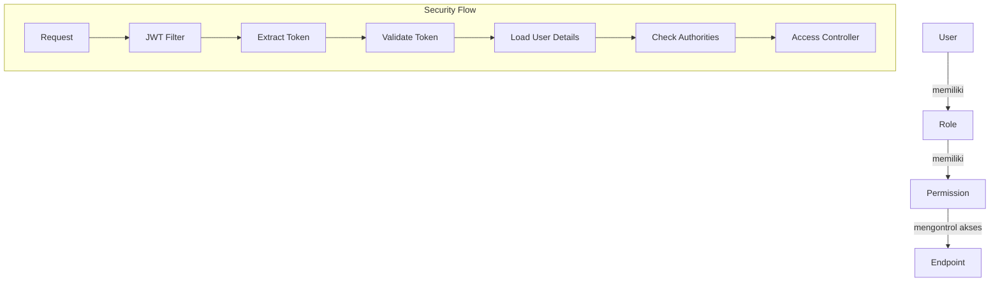
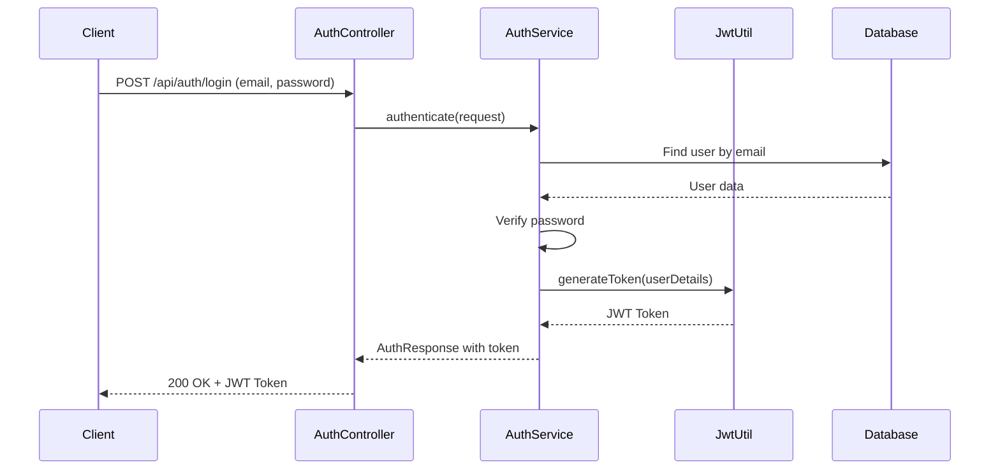
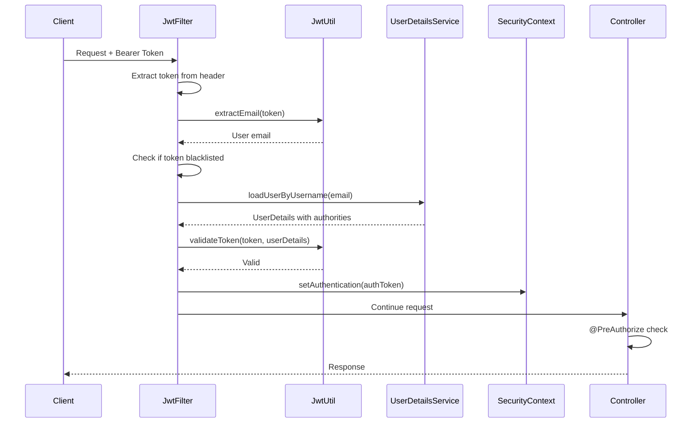
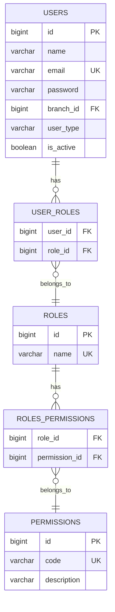

# Hak Akses (Access Rights) Documentation

Dokumen ini menjelaskan secara lengkap sistem hak akses dan keamanan pada aplikasi Binar-BE, termasuk alur autentikasi, role, permission, dan code implementation-nya.

---

## 📋 Daftar Isi

1. [Overview Sistem Keamanan](#overview-sistem-keamanan)
2. [Role dan Permission](#role-dan-permission)
3. [Alur Autentikasi](#alur-autentikasi)
4. [Code Implementation](#code-implementation)
5. [Endpoint Access Matrix](#endpoint-access-matrix)

---

## Overview Sistem Keamanan

Aplikasi ini menggunakan **Role-Based Access Control (RBAC)** dengan tambahan **Permission-Based Access Control**. Sistem ini terdiri dari:



### Komponen Utama

| Komponen                   | Fungsi                                          |
| -------------------------- | ----------------------------------------------- |
| `SecurityConfig`           | Konfigurasi keamanan Spring Security            |
| `JwtAuthenticationFilter`  | Filter untuk validasi JWT token                 |
| `CustomUserDetailsService` | Service untuk load user dan authorities         |
| `Role`                     | Entity role yang dimiliki user                  |
| `Permission`               | Entity permission granular untuk akses endpoint |

---

## Role dan Permission

### Daftar Role

```java
// File: src/main/java/com/gvn/binarbe/enums/RoleName.java

public enum RoleName {
  SUPERADMIN,      // Full system access - akses penuh ke semua fitur
  MARKETING,       // Branch-restricted loan processing - proses pinjaman di cabang
  BRANCH_MANAGER,  // Branch-restricted loan approval - approval pinjaman di cabang
  BACKOFFICE,      // Final approval across all branches - approval akhir semua cabang
  CUSTOMER         // External customer access - akses pelanggan eksternal
}
```

### Daftar Permission

Berdasarkan code yang ada, permission digunakan di controller dengan anotasi `@PreAuthorize`:

| Permission Code               | Deskripsi                           | Digunakan Oleh                        |
| ----------------------------- | ----------------------------------- | ------------------------------------- |
| `LOAN_CREATE`                 | Membuat pengajuan pinjaman baru     | Customer                              |
| `LOAN_READ`                   | Melihat data pinjaman sendiri       | Customer                              |
| `LOAN_READ_BRANCH`            | Melihat pinjaman di cabang tertentu | Marketing, Branch Manager             |
| `LOAN_READ_ALL`               | Melihat semua pinjaman              | Backoffice, Superadmin                |
| `LOAN_APPROVE_MARKETING`      | Approval level marketing            | Marketing                             |
| `LOAN_APPROVE_BRANCH_MANAGER` | Approval level branch manager       | Branch Manager                        |
| `LOAN_APPROVE_BACKOFFICE`     | Approval final backoffice           | Backoffice                            |
| `LOAN_REJECT`                 | Menolak pengajuan pinjaman          | Marketing, Branch Manager, Backoffice |
| `PROFILE_READ`                | Melihat profil sendiri              | Customer                              |
| `PROFILE_UPDATE`              | Update profil sendiri               | Customer                              |
| `PLAFOND_SELECT`              | Memilih plafond/limit kredit        | Customer                              |
| `PLAFOND_READ`                | Melihat plafond aktif               | Customer                              |

---

## Alur Autentikasi

### 1. Login Flow



### 2. Request Authentication Flow



---

## Code Implementation

### 1. SecurityConfig - Konfigurasi Keamanan Utama

```java
// File: src/main/java/com/gvn/binarbe/config/SecurityConfig.java

@Configuration
@EnableWebSecurity
@EnableMethodSecurity  // Mengaktifkan @PreAuthorize
@RequiredArgsConstructor
public class SecurityConfig {

  private final JwtAuthenticationFilter jwtAuthFilter;
  private final UserDetailsService userDetailsService;

  @Bean
  public SecurityFilterChain securityFilterChain(HttpSecurity http) throws Exception {
    http.csrf(AbstractHttpConfigurer::disable)
        .authorizeHttpRequests(
            auth ->
                auth
                    // Public endpoints - tidak perlu login
                    .requestMatchers("/api/auth/**")
                    .permitAll()
                    .requestMatchers(HttpMethod.GET, "/api/products/**")
                    .permitAll()
                    .requestMatchers(HttpMethod.GET, "/api/branches/**")
                    .permitAll()
                    .requestMatchers("/error")
                    .permitAll()

                    // Admin endpoints - hanya SUPERADMIN
                    .requestMatchers("/api/admin/**")
                    .hasRole("SUPERADMIN")

                    // Semua request lain butuh autentikasi
                    // Kontrol akses berdasarkan permission di @PreAuthorize
                    .anyRequest()
                    .authenticated())
        .sessionManagement(
            session -> session.sessionCreationPolicy(SessionCreationPolicy.STATELESS))
        .addFilterBefore(jwtAuthFilter, UsernamePasswordAuthenticationFilter.class);

    return http.build();
  }

  @Bean
  public AuthenticationManager authenticationManager(HttpSecurity http) throws Exception {
    AuthenticationManagerBuilder authBuilder =
        http.getSharedObject(AuthenticationManagerBuilder.class);
    authBuilder.userDetailsService(userDetailsService).passwordEncoder(passwordEncoder());
    return authBuilder.build();
  }

  @Bean
  public PasswordEncoder passwordEncoder() {
    return new BCryptPasswordEncoder();
  }
}
```

**Penjelasan:**

- `@EnableMethodSecurity` - Mengaktifkan anotasi `@PreAuthorize` di controller
- `permitAll()` - Endpoint yang bisa diakses tanpa login
- `hasRole("SUPERADMIN")` - Hanya role SUPERADMIN yang bisa akses
- `authenticated()` - Harus login, pengecekan permission dilakukan di controller
- `SessionCreationPolicy.STATELESS` - Tidak menggunakan session, murni JWT

---

### 2. JwtAuthenticationFilter - Filter Validasi Token

```java
// File: src/main/java/com/gvn/binarbe/security/JwtAuthenticationFilter.java

@Slf4j
@Component
@RequiredArgsConstructor
public class JwtAuthenticationFilter extends OncePerRequestFilter {

  private final JwtUtil jwtUtil;
  private final UserDetailsService userDetailsService;
  private final TokenBlacklistService tokenBlacklistService;

  @Override
  protected void doFilterInternal(
      HttpServletRequest request, HttpServletResponse response, FilterChain filterChain)
      throws ServletException, IOException {

    final String authHeader = request.getHeader("Authorization");
    final String jwt;
    final String userEmail;

    // Cek apakah ada Bearer token
    if (authHeader == null || !authHeader.startsWith("Bearer ")) {
      filterChain.doFilter(request, response);
      return;
    }

    jwt = authHeader.substring(7);  // Ambil token tanpa "Bearer "

    try {
      userEmail = jwtUtil.extractEmail(jwt);

      // Jika email valid dan belum ada authentication
      if (userEmail != null && SecurityContextHolder.getContext().getAuthentication() == null) {

        // Cek apakah token sudah di-blacklist (logout)
        Date issuedAt = jwtUtil.extractIssuedAt(jwt);
        if (tokenBlacklistService.isTokenBlacklisted(jwt, userEmail, issuedAt.getTime())) {
          log.debug("Token is blacklisted for user: {}", userEmail);
          filterChain.doFilter(request, response);
          return;
        }

        // Load user details dengan roles dan permissions
        UserDetails userDetails = this.userDetailsService.loadUserByUsername(userEmail);

        // Validasi token
        if (jwtUtil.validateToken(jwt, userDetails)) {
          // Buat authentication token dengan authorities
          UsernamePasswordAuthenticationToken authToken =
              new UsernamePasswordAuthenticationToken(
                  userDetails, null, userDetails.getAuthorities());
          authToken.setDetails(new WebAuthenticationDetailsSource().buildDetails(request));

          // Set ke SecurityContext agar bisa diakses di controller
          SecurityContextHolder.getContext().setAuthentication(authToken);
          log.debug(
              "Authenticated user: {} with roles: {}", userEmail, userDetails.getAuthorities());
        }
      }
    } catch (Exception e) {
      log.error("Cannot set user authentication: {}", e.getMessage());
    }

    filterChain.doFilter(request, response);
  }
}
```

**Penjelasan:**

- Filter ini berjalan di setiap request sebelum masuk controller
- Mengekstrak JWT dari header `Authorization: Bearer <token>`
- Cek token blacklist untuk menangani logout
- Load user beserta authorities (roles + permissions)
- Set authentication ke SecurityContext

---

### 3. CustomUserDetailsService - Load User dan Authorities

```java
// File: src/main/java/com/gvn/binarbe/security/CustomUserDetailsService.java

@Service
@RequiredArgsConstructor
public class CustomUserDetailsService implements UserDetailsService {

  private final UserRepository userRepository;

  @Override
  @Transactional(readOnly = true)
  public UserDetails loadUserByUsername(String email) throws UsernameNotFoundException {
    // Load user dengan roles (EAGER fetch)
    User user =
        userRepository
            .findByEmailWithRoles(email)
            .orElseThrow(
                () -> new UsernameNotFoundException("User not found with email: " + email));

    // Cek apakah user aktif
    if (!user.getIsActive()) {
      throw new UsernameNotFoundException("User account is disabled");
    }

    // Return Spring Security UserDetails dengan authorities
    return new org.springframework.security.core.userdetails.User(
        user.getEmail(),
        user.getPassword(),
        user.getIsActive(),
        true,  // accountNonExpired
        true,  // credentialsNonExpired
        true,  // accountNonLocked
        getAuthorities(user));  // Authorities dari roles + permissions
  }

  /**
   * Build granted authorities dari roles dan permissions.
   * Role name diprefix dengan "ROLE_" untuk Spring Security.
   * Permissions ditambahkan langsung sebagai authorities.
   */
  private Collection<? extends GrantedAuthority> getAuthorities(User user) {
    Set<GrantedAuthority> authorities = new HashSet<>();

    user.getRoles()
        .forEach(
            role -> {
              // Tambah role authority dengan prefix ROLE_
              // Contoh: ROLE_CUSTOMER, ROLE_MARKETING
              authorities.add(new SimpleGrantedAuthority("ROLE_" + role.getName().name()));

              // Tambah permission authorities dari setiap role
              // Contoh: LOAN_CREATE, PROFILE_READ
              role.getPermissions()
                  .forEach(
                      permission ->
                          authorities.add(new SimpleGrantedAuthority(permission.getCode())));
            });

    return authorities;
  }
}
```

**Penjelasan:**

- Method `getAuthorities()` mengonversi roles dan permissions menjadi Spring Security authorities
- Role diprefix dengan `ROLE_` (konvensi Spring Security)
- Permission langsung ditambahkan tanpa prefix
- Hasil akhir: user punya authorities seperti `[ROLE_CUSTOMER, LOAN_CREATE, LOAN_READ, ...]`

---

### 4. Entity: User

```java
// File: src/main/java/com/gvn/binarbe/entity/User.java

@Entity
@Table(name = "users")
@Getter
@Setter
@NoArgsConstructor
@AllArgsConstructor
@Builder
public class User {

  @Id
  @GeneratedValue(strategy = GenerationType.IDENTITY)
  private Long id;

  @Column(nullable = false)
  private String name;

  @Column(nullable = false, unique = true)
  private String email;

  @Column(nullable = false)
  private String password;

  @ManyToOne(fetch = FetchType.LAZY)
  @JoinColumn(name = "branch_id")
  private Branch branch; // nullable untuk customers

  @Enumerated(EnumType.STRING)
  @Column(name = "user_type", nullable = false)
  private UserType userType;

  @Column(name = "is_active", nullable = false)
  @Builder.Default
  private Boolean isActive = true;

  // Relasi Many-to-Many dengan Role
  @ManyToMany(fetch = FetchType.EAGER)
  @JoinTable(
      name = "user_roles",
      joinColumns = @JoinColumn(name = "user_id"),
      inverseJoinColumns = @JoinColumn(name = "role_id"))
  @Builder.Default
  private Set<Role> roles = new HashSet<>();

  /** Cek apakah user memiliki role tertentu. */
  public boolean hasRole(String roleName) {
    return roles.stream().anyMatch(role -> role.getName().name().equalsIgnoreCase(roleName));
  }
}
```

---

### 5. Entity: Role

```java
// File: src/main/java/com/gvn/binarbe/entity/Role.java

@Entity
@Table(name = "roles")
@Getter
@Setter
@NoArgsConstructor
@AllArgsConstructor
@Builder
public class Role {

  @Id
  @GeneratedValue(strategy = GenerationType.IDENTITY)
  private Long id;

  @Enumerated(EnumType.STRING)
  @Column(nullable = false, unique = true)
  private RoleName name;

  // Relasi dengan User
  @ManyToMany(mappedBy = "roles")
  @Builder.Default
  private Set<User> users = new HashSet<>();

  // Relasi dengan Permission (EAGER untuk load saat auth)
  @ManyToMany(fetch = FetchType.EAGER)
  @JoinTable(
      name = "roles_permissions",
      joinColumns = @JoinColumn(name = "role_id"),
      inverseJoinColumns = @JoinColumn(name = "permission_id"))
  @Builder.Default
  private Set<Permission> permissions = new HashSet<>();
}
```

---

### 6. Entity: Permission

```java
// File: src/main/java/com/gvn/binarbe/entity/Permission.java

@Entity
@Table(name = "permissions")
@Getter
@Setter
@NoArgsConstructor
@AllArgsConstructor
@Builder
public class Permission {

  @Id
  @GeneratedValue(strategy = GenerationType.IDENTITY)
  private Long id;

  @Column(nullable = false, unique = true)
  private String code;  // Contoh: LOAN_CREATE, PROFILE_READ

  @Column
  private String description;

  @ManyToMany(mappedBy = "permissions")
  @Builder.Default
  private Set<Role> roles = new HashSet<>();
}
```

---

### 7. Controller dengan @PreAuthorize

#### LoanApplicationController

```java
// File: src/main/java/com/gvn/binarbe/controller/LoanApplicationController.java

@RestController
@RequestMapping("/api/loans")
@RequiredArgsConstructor
public class LoanApplicationController {

  private final LoanApplicationService loanApplicationService;

  /** Submit pinjaman baru - butuh permission LOAN_CREATE */
  @PostMapping
  @PreAuthorize("hasAuthority('LOAN_CREATE')")
  public ResponseEntity<ApiResponse<LoanApplicationResponse>> submitLoan(
      @AuthenticationPrincipal UserDetails userDetails,
      @Valid @RequestBody LoanApplicationRequest request) {
    // ...
  }

  /** Lihat semua pinjaman user - butuh permission LOAN_READ */
  @GetMapping
  @PreAuthorize("hasAuthority('LOAN_READ')")
  public ResponseEntity<ApiResponse<List<LoanApplicationResponse>>> getMyLoans(
      @AuthenticationPrincipal UserDetails userDetails) {
    // ...
  }

  /** Lihat detail pinjaman - butuh permission LOAN_READ */
  @GetMapping("/{id}")
  @PreAuthorize("hasAuthority('LOAN_READ')")
  public ResponseEntity<ApiResponse<LoanApplicationResponse>> getLoanById(
      @AuthenticationPrincipal UserDetails userDetails, @PathVariable Long id) {
    // ...
  }

  /** Lihat history approval - butuh permission LOAN_READ */
  @GetMapping("/{id}/history")
  @PreAuthorize("hasAuthority('LOAN_READ')")
  public ResponseEntity<ApiResponse<List<LoanHistoryResponse>>> getLoanHistory(
      @AuthenticationPrincipal UserDetails userDetails, @PathVariable Long id) {
    // ...
  }
}
```

#### ApprovalController

```java
// File: src/main/java/com/gvn/binarbe/controller/ApprovalController.java

@RestController
@RequestMapping("/api/approval")
@RequiredArgsConstructor
public class ApprovalController {

  private final ApprovalService approvalService;

  /** Lihat pending loans - butuh LOAN_READ_BRANCH atau LOAN_READ_ALL */
  @GetMapping("/pending")
  @PreAuthorize("hasAnyAuthority('LOAN_READ_BRANCH', 'LOAN_READ_ALL')")
  public ResponseEntity<ApiResponse<List<LoanApplicationResponse>>> getPendingLoans(
      @AuthenticationPrincipal UserDetails userDetails) {
    // ...
  }

  /** Approve loan - butuh salah satu dari permission approval */
  @PostMapping("/{id}/approve")
  @PreAuthorize(
      "hasAnyAuthority('LOAN_APPROVE_MARKETING', 'LOAN_APPROVE_BRANCH_MANAGER', 'LOAN_APPROVE_BACKOFFICE')")
  public ResponseEntity<ApiResponse<LoanApplicationResponse>> approve(
      @AuthenticationPrincipal UserDetails userDetails,
      @PathVariable Long id,
      @Valid @RequestBody(required = false) ApprovalRequest request) {
    // ...
  }

  /** Reject loan - butuh permission LOAN_REJECT */
  @PostMapping("/{id}/reject")
  @PreAuthorize("hasAuthority('LOAN_REJECT')")
  public ResponseEntity<ApiResponse<LoanApplicationResponse>> reject(
      @AuthenticationPrincipal UserDetails userDetails,
      @PathVariable Long id,
      @Valid @RequestBody ApprovalRequest request) {
    // ...
  }
}
```

#### CustomerController

```java
// File: src/main/java/com/gvn/binarbe/controller/CustomerController.java

@RestController
@RequiredArgsConstructor
public class CustomerController {

  private final CustomerService customerService;
  private final PlafondService plafondService;

  /** Lihat profil - butuh permission PROFILE_READ */
  @GetMapping("/api/customer/profile")
  @PreAuthorize("hasAuthority('PROFILE_READ')")
  public ResponseEntity<ApiResponse<UserResponse>> getProfile(
      @AuthenticationPrincipal UserDetails userDetails) {
    // ...
  }

  /** Update profil - butuh permission PROFILE_UPDATE */
  @PutMapping("/api/customer/profile")
  @PreAuthorize("hasAuthority('PROFILE_UPDATE')")
  public ResponseEntity<ApiResponse<UserProfileResponse>> updateProfile(
      @AuthenticationPrincipal UserDetails userDetails,
      @Valid @RequestBody UpdateProfileRequest request) {
    // ...
  }

  /** Pilih plafond - butuh permission PLAFOND_SELECT */
  @PostMapping("/api/customer/plafond")
  @PreAuthorize("hasAuthority('PLAFOND_SELECT')")
  public ResponseEntity<ApiResponse<UserPlafondResponse>> selectPlafond(
      @AuthenticationPrincipal UserDetails userDetails,
      @Valid @RequestBody SelectPlafondRequest request) {
    // ...
  }

  /** Lihat plafond aktif - butuh permission PLAFOND_READ */
  @GetMapping("/api/customer/plafond")
  @PreAuthorize("hasAuthority('PLAFOND_READ')")
  public ResponseEntity<ApiResponse<UserPlafondResponse>> getMyPlafond(
      @AuthenticationPrincipal UserDetails userDetails) {
    // ...
  }

  /** Lihat semua produk - PUBLIC, tidak perlu login */
  @GetMapping("/api/products")
  public ResponseEntity<ApiResponse<List<ProductResponse>>> getAllProducts() {
    // ...
  }

  /** Lihat semua cabang - PUBLIC, tidak perlu login */
  @GetMapping("/api/branches")
  public ResponseEntity<ApiResponse<List<BranchResponse>>> getAllBranches() {
    // ...
  }
}
```

---

## Endpoint Access Matrix

### Public Endpoints (Tanpa Login)

| Endpoint           | Method | Deskripsi                                                    |
| ------------------ | ------ | ------------------------------------------------------------ |
| `/api/auth/**`     | ALL    | Semua endpoint autentikasi (login, register, reset password) |
| `/api/products/**` | GET    | Lihat daftar produk                                          |
| `/api/branches/**` | GET    | Lihat daftar cabang                                          |
| `/error`           | ALL    | Error page                                                   |

### Protected Endpoints (Butuh Login + Permission)

| Endpoint                     | Method | Permission                          | Role yang Memiliki                    |
| ---------------------------- | ------ | ----------------------------------- | ------------------------------------- |
| `/api/loans`                 | POST   | `LOAN_CREATE`                       | Customer                              |
| `/api/loans`                 | GET    | `LOAN_READ`                         | Customer                              |
| `/api/loans/{id}`            | GET    | `LOAN_READ`                         | Customer                              |
| `/api/loans/{id}/history`    | GET    | `LOAN_READ`                         | Customer                              |
| `/api/approval/pending`      | GET    | `LOAN_READ_BRANCH`, `LOAN_READ_ALL` | Marketing, Branch Manager, Backoffice |
| `/api/approval/{id}/approve` | POST   | `LOAN_APPROVE_*`                    | Marketing, Branch Manager, Backoffice |
| `/api/approval/{id}/reject`  | POST   | `LOAN_REJECT`                       | Marketing, Branch Manager, Backoffice |
| `/api/customer/profile`      | GET    | `PROFILE_READ`                      | Customer                              |
| `/api/customer/profile`      | PUT    | `PROFILE_UPDATE`                    | Customer                              |
| `/api/customer/plafond`      | POST   | `PLAFOND_SELECT`                    | Customer                              |
| `/api/customer/plafond`      | GET    | `PLAFOND_READ`                      | Customer                              |
| `/api/admin/**`              | ALL    | Role `SUPERADMIN`                   | Superadmin                            |

### Role-Permission Matrix

| Role               | Permissions                                                                                    |
| ------------------ | ---------------------------------------------------------------------------------------------- |
| **CUSTOMER**       | `LOAN_CREATE`, `LOAN_READ`, `PROFILE_READ`, `PROFILE_UPDATE`, `PLAFOND_SELECT`, `PLAFOND_READ` |
| **MARKETING**      | `LOAN_READ_BRANCH`, `LOAN_APPROVE_MARKETING`, `LOAN_REJECT`                                    |
| **BRANCH_MANAGER** | `LOAN_READ_BRANCH`, `LOAN_APPROVE_BRANCH_MANAGER`, `LOAN_REJECT`                               |
| **BACKOFFICE**     | `LOAN_READ_ALL`, `LOAN_APPROVE_BACKOFFICE`, `LOAN_REJECT`                                      |
| **SUPERADMIN**     | Semua akses (via `hasRole("SUPERADMIN")`)                                                      |

---

## Database Schema



---

## Ringkasan

1. **Autentikasi** menggunakan JWT token yang dikirim via header `Authorization: Bearer <token>`
2. **Otorisasi** menggunakan kombinasi:
   - URL-based: dikonfigurasi di `SecurityConfig` (`permitAll()`, `hasRole()`)
   - Method-based: menggunakan `@PreAuthorize` di controller
3. **Hierarchi akses**:
   - User memiliki Role(s)
   - Role memiliki Permission(s)
   - Permission mengontrol akses ke endpoint spesifik
4. **Token blacklist** di-support untuk fitur logout
5. **Stateless session** - tidak ada server-side session, semua state ada di JWT token
