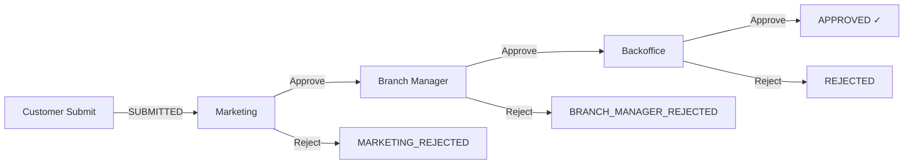
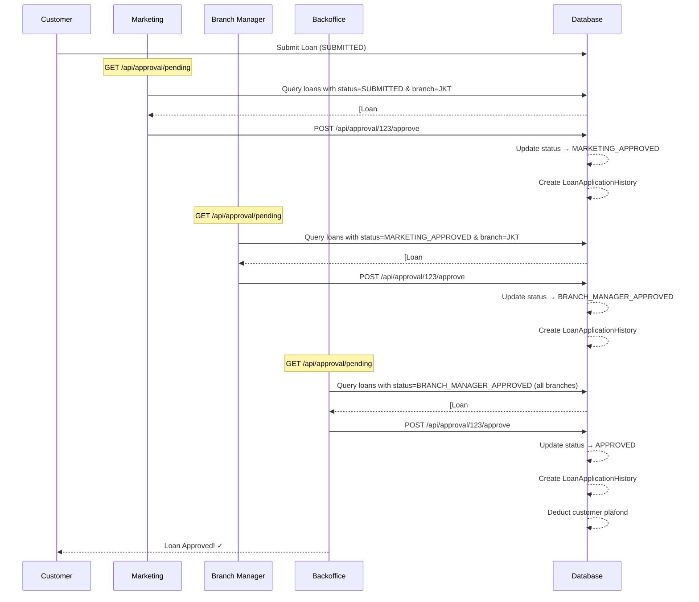

# Multi-Level Approval Flow

Dokumen ini menjelaskan alur persetujuan (approval) bertingkat untuk pengajuan pinjaman (loan application) yang melibatkan tiga role: **Marketing**, **Branch Manager**, dan **Backoffice**.

## Gambaran Umum

Sistem persetujuan pinjaman menggunakan alur bertingkat 3 tahap:



## Role dan Permission

Setiap role memiliki permission (izin) yang berbeda dalam proses approval:

| Role               | Permission                    | Deskripsi                         |
| ------------------ | ----------------------------- | --------------------------------- |
| **MARKETING**      | `LOAN_APPROVE_MARKETING`      | Persetujuan tahap 1 (per cabang)  |
| **BRANCH_MANAGER** | `LOAN_APPROVE_BRANCH_MANAGER` | Persetujuan tahap 2 (per cabang)  |
| **BACKOFFICE**     | `LOAN_APPROVE_BACKOFFICE`     | Persetujuan final (semua cabang)  |
| **ALL**            | `LOAN_REJECT`                 | Kemampuan untuk menolak pengajuan |

> [!IMPORTANT] > **Marketing** dan **Branch Manager** hanya dapat melihat dan memproses pengajuan dari cabang mereka sendiri. **Backoffice** dapat memproses pengajuan dari semua cabang.

## Status Loan Application

Status pengajuan pinjaman diatur dalam [LoanStatus.java](file:///Users/given/IdeaProjects/binar-be/src/main/java/com/gvn/binarbe/enums/LoanStatus.java):

```java
public enum LoanStatus {
  SUBMITTED,              // Customer submit (initial)
  MARKETING_APPROVED,     // Disetujui Marketing → ke Branch Manager
  MARKETING_REJECTED,     // Ditolak Marketing
  BRANCH_MANAGER_APPROVED, // Disetujui Branch Manager → ke Backoffice
  BRANCH_MANAGER_REJECTED, // Ditolak Branch Manager
  APPROVED,               // Disetujui Backoffice (FINAL)
  REJECTED                // Ditolak Backoffice (FINAL)
}
```

## API Endpoints

Approval flow diakses melalui endpoint berikut yang didefinisikan di [ApprovalController.java](file:///Users/given/IdeaProjects/binar-be/src/main/java/com/gvn/binarbe/controller/ApprovalController.java):

| Method | Endpoint                     | Deskripsi                        | Permission Required                     |
| ------ | ---------------------------- | -------------------------------- | --------------------------------------- |
| `GET`  | `/api/approval/pending`      | Lihat loan yang pending approval | `LOAN_READ_BRANCH` atau `LOAN_READ_ALL` |
| `POST` | `/api/approval/{id}/approve` | Approve sebuah loan              | `LOAN_APPROVE_*` (sesuai role)          |
| `POST` | `/api/approval/{id}/reject`  | Reject sebuah loan               | `LOAN_REJECT`                           |

---

## Penjelasan Code

### 1. Controller Layer

**File**: [ApprovalController.java](file:///Users/given/IdeaProjects/binar-be/src/main/java/com/gvn/binarbe/controller/ApprovalController.java)

Controller ini meng-handle semua request terkait approval:

```java
@RestController
@RequestMapping("/api/approval")
public class ApprovalController {

  // Endpoint untuk melihat pending loans
  @GetMapping("/pending")
  @PreAuthorize("hasAnyAuthority('LOAN_READ_BRANCH', 'LOAN_READ_ALL')")
  public ResponseEntity<ApiResponse<List<LoanApplicationResponse>>> getPendingLoans(...) {
    // Mengembalikan loan berdasarkan role dan branch user
  }

  // Endpoint untuk approve
  @PostMapping("/{id}/approve")
  @PreAuthorize("hasAnyAuthority('LOAN_APPROVE_MARKETING', 'LOAN_APPROVE_BRANCH_MANAGER', 'LOAN_APPROVE_BACKOFFICE')")
  public ResponseEntity<ApiResponse<LoanApplicationResponse>> approve(...) {
    // Memajukan loan ke stage berikutnya
  }

  // Endpoint untuk reject
  @PostMapping("/{id}/reject")
  @PreAuthorize("hasAuthority('LOAN_REJECT')")
  public ResponseEntity<ApiResponse<LoanApplicationResponse>> reject(...) {
    // Menolak pengajuan loan
  }
}
```

> [!NOTE]
> Annotation `@PreAuthorize` memastikan hanya user dengan permission yang tepat yang bisa mengakses endpoint.

---

### 2. Service Layer (Business Logic)

**File**: [ApprovalServiceImpl.java](file:///Users/given/IdeaProjects/binar-be/src/main/java/com/gvn/binarbe/service/impl/ApprovalServiceImpl.java)

Ini adalah file utama yang mengimplementasikan logika approval bertingkat.

#### a. Menentukan Role Tertinggi User

```java
private RoleName getHighestRole(User user) {
  Set<RoleName> roleNames = user.getRoles().stream()
      .map(Role::getName)
      .collect(Collectors.toSet());

  // Prioritas: BACKOFFICE > BRANCH_MANAGER > MARKETING
  if (roleNames.contains(RoleName.BACKOFFICE)) return RoleName.BACKOFFICE;
  if (roleNames.contains(RoleName.BRANCH_MANAGER)) return RoleName.BRANCH_MANAGER;
  if (roleNames.contains(RoleName.MARKETING)) return RoleName.MARKETING;

  throw BusinessException.forbidden("You don't have any approval role");
}
```

#### b. Menentukan Status yang Diharapkan per Role

Setiap role hanya bisa memproses loan dengan status tertentu:

```java
private LoanStatus getExpectedStatus(RoleName role) {
  return switch (role) {
    case MARKETING -> LoanStatus.SUBMITTED;              // Marketing handles SUBMITTED
    case BRANCH_MANAGER -> LoanStatus.MARKETING_APPROVED; // BM handles after Marketing
    case BACKOFFICE -> LoanStatus.BRANCH_MANAGER_APPROVED;// BO handles after BM
    default -> throw BusinessException.forbidden("Invalid role for approval");
  };
}
```

#### c. Proses Approval

```java
public LoanApplicationResponse approve(String email, Long loanId, ApprovalRequest request) {
  User approver = getApprover(email);
  RoleName role = getHighestRole(approver);
  LoanApplication loan = getLoanForApproval(loanId, approver, role);

  // Tentukan status baru berdasarkan role
  LoanStatus newStatus = switch (role) {
    case MARKETING -> LoanStatus.MARKETING_APPROVED;
    case BRANCH_MANAGER -> LoanStatus.BRANCH_MANAGER_APPROVED;
    case BACKOFFICE -> LoanStatus.APPROVED;
    default -> throw BusinessException.forbidden("You don't have approval permission");
  };

  loan.setStatus(newStatus);
  loan = loanApplicationRepository.save(loan);

  // Jika final approval, kurangi plafond customer
  if (newStatus == LoanStatus.APPROVED) {
    // Deduct remaining amount from plafond
    // ...
  }

  // Simpan history
  createHistoryEntry(loan, approver, role, newStatus, request.getNote());

  return mapToLoanResponse(loan);
}
```

#### d. Validasi Branch Restriction

Marketing dan Branch Manager hanya bisa handle loan dari cabang mereka:

```java
private LoanApplication getLoanForApproval(Long loanId, User approver, RoleName role) {
  LoanApplication loan = loanApplicationRepository.findByIdWithDetails(loanId)
      .orElseThrow(() -> BusinessException.notFound("Loan application not found"));

  LoanStatus expectedStatus = getExpectedStatus(role);

  // Validasi status
  if (loan.getStatus() != expectedStatus) {
    throw BusinessException.badRequest(
        "Loan is not in the correct status for your approval. " +
        "Current status: " + loan.getStatus() + ", Expected: " + expectedStatus);
  }

  // Validasi branch (kecuali BACKOFFICE)
  if (role != RoleName.BACKOFFICE) {
    if (approver.getBranch() == null) {
      throw BusinessException.badRequest("You are not assigned to any branch");
    }
    if (!loan.getBranch().getId().equals(approver.getBranch().getId())) {
      throw BusinessException.forbidden("You can only process loans from your branch");
    }
  }

  return loan;
}
```

---

### 3. Entity Layer

#### LoanApplication

**File**: [LoanApplication.java](file:///Users/given/IdeaProjects/binar-be/src/main/java/com/gvn/binarbe/entity/LoanApplication.java)

Entity ini menyimpan data pengajuan pinjaman dan statusnya:

```java
@Entity
@Table(name = "loan_applications")
public class LoanApplication {
  @Enumerated(EnumType.STRING)
  @Column(nullable = false)
  @Builder.Default
  private LoanStatus status = LoanStatus.SUBMITTED;

  @OneToMany(mappedBy = "loanApplication", cascade = CascadeType.ALL)
  @OrderBy("createdAt ASC")
  private List<LoanApplicationHistory> histories = new ArrayList<>();
}
```

#### LoanApplicationHistory

**File**: [LoanApplicationHistory.java](file:///Users/given/IdeaProjects/binar-be/src/main/java/com/gvn/binarbe/entity/LoanApplicationHistory.java)

Entity ini mencatat jejak audit setiap tindakan approval/rejection:

```java
@Entity
@Table(name = "loan_application_histories")
public class LoanApplicationHistory {
  @ManyToOne(fetch = FetchType.LAZY)
  @JoinColumn(name = "approved_by", nullable = false)
  private User approvedBy;

  // Snapshot role saat approval (untuk audit)
  @Column(name = "approved_by_role", nullable = false)
  private String approvedByRole;

  // Snapshot branch ID saat approval
  @Column(name = "approved_by_branch_id")
  private Integer approvedByBranchId;

  @Enumerated(EnumType.STRING)
  private LoanStatus status;

  private String note;
  private LocalDateTime createdAt;
}
```

> [!TIP]
> History mencatat **snapshot** role dan branch approver untuk menjaga akurasi historis, bahkan jika data user berubah di kemudian hari.

---

### 4. Role & Permission Setup

**File**: [DataInitializer.java](file:///Users/given/IdeaProjects/binar-be/src/main/java/com/gvn/binarbe/initializer/DataInitializer.java#L105-L121)

Approval permissions dibuat saat inisialisasi:

```java
// Approval permissions
Permission.builder()
    .code("LOAN_APPROVE_MARKETING")
    .description("Approve as Marketing")
    .build(),
Permission.builder()
    .code("LOAN_APPROVE_BRANCH_MANAGER")
    .description("Approve as Branch Manager")
    .build(),
Permission.builder()
    .code("LOAN_APPROVE_BACKOFFICE")
    .description("Final approval as Backoffice")
    .build(),
Permission.builder()
    .code("LOAN_REJECT")
    .description("Reject loan applications")
    .build(),
```

Dan permission ini di-assign ke role masing-masing:

```java
// MARKETING - branch-restricted loan processing
Set<Permission> marketingPerms = new HashSet<>(Arrays.asList(
    loanReadBranch, loanApproveMarketing, loanReject, ...));

// BRANCH_MANAGER - branch-restricted loan approval
Set<Permission> branchManagerPerms = new HashSet<>(Arrays.asList(
    loanReadBranch, loanApproveBranchManager, loanReject, ...));

// BACKOFFICE - final approval across all branches
Set<Permission> backofficePerms = new HashSet<>(Arrays.asList(
    loanReadAll, loanApproveBackoffice, loanReject, ...));
```

---

## Flow Diagram Detail



---

## Contoh Request/Response

### Approve Loan (Marketing)

**Request:**

```http
POST /api/approval/1/approve
Authorization: Bearer <marketing_token>
Content-Type: application/json

{
  "note": "Dokumen lengkap, disetujui."
}
```

**Response:**

```json
{
  "success": true,
  "message": "Loan approved successfully",
  "data": {
    "id": 1,
    "customerName": "John Doe",
    "requestedAmount": 5000000,
    "status": "MARKETING_APPROVED",
    ...
  }
}
```

### Reject Loan

**Request:**

```http
POST /api/approval/1/reject
Authorization: Bearer <any_approver_token>
Content-Type: application/json

{
  "note": "Dokumen tidak lengkap."
}
```

---

## Summary File Locations

| File                                                                                                                                      | Purpose                               |
| ----------------------------------------------------------------------------------------------------------------------------------------- | ------------------------------------- |
| [ApprovalController.java](file:///Users/given/IdeaProjects/binar-be/src/main/java/com/gvn/binarbe/controller/ApprovalController.java)     | REST endpoints untuk approval         |
| [ApprovalService.java](file:///Users/given/IdeaProjects/binar-be/src/main/java/com/gvn/binarbe/service/ApprovalService.java)              | Interface service layer               |
| [ApprovalServiceImpl.java](file:///Users/given/IdeaProjects/binar-be/src/main/java/com/gvn/binarbe/service/impl/ApprovalServiceImpl.java) | **Implementasi utama approval logic** |
| [LoanStatus.java](file:///Users/given/IdeaProjects/binar-be/src/main/java/com/gvn/binarbe/enums/LoanStatus.java)                          | Enum status loan                      |
| [RoleName.java](file:///Users/given/IdeaProjects/binar-be/src/main/java/com/gvn/binarbe/enums/RoleName.java)                              | Enum nama role                        |
| [LoanApplication.java](file:///Users/given/IdeaProjects/binar-be/src/main/java/com/gvn/binarbe/entity/LoanApplication.java)               | Entity loan application               |
| [LoanApplicationHistory.java](file:///Users/given/IdeaProjects/binar-be/src/main/java/com/gvn/binarbe/entity/LoanApplicationHistory.java) | Entity audit trail                    |
| [DataInitializer.java](file:///Users/given/IdeaProjects/binar-be/src/main/java/com/gvn/binarbe/initializer/DataInitializer.java)          | Setup permissions & roles             |
