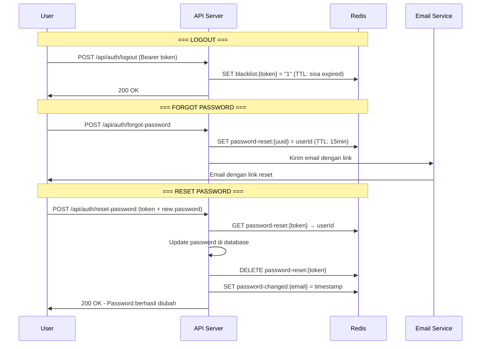

# Token Management & Redis Storage

Dokumentasi ini menjelaskan bagaimana sistem mengelola token di Redis untuk berbagai skenario: logout, forgot password, dan reset password.

---

## Ringkasan Redis Keys

| Key Pattern                | Value          | TTL                    | Fungsi                                        |
| -------------------------- | -------------- | ---------------------- | --------------------------------------------- |
| `blacklist:{jwt-token}`    | `"1"`          | Sisa waktu expired JWT | Blacklist token spesifik saat logout          |
| `password-reset:{uuid}`    | User ID        | 15 menit               | Token reset password dari email               |
| `password-changed:{email}` | Timestamp (ms) | 24 jam (JWT expiry)    | Invalidate semua token setelah ganti password |

---

## 1. Logout - Blacklist Token Spesifik

**Skenario**: User klik logout, token yang sedang dipakai harus diblokir.

### Redis Key

```
blacklist:eyJhbGciOiJIUzI1NiIsInR5cCI6IkpXVCJ9...
```

### Cara Kerja

```java
// AuthServiceImpl.java - logout()
public void logout(String token) {
    Date expiration = jwtUtil.extractExpiration(token);
    long ttlMillis = expiration.getTime() - System.currentTimeMillis();

    tokenBlacklistService.blacklistToken(token, ttlMillis);
}

// TokenBlacklistServiceImpl.java - blacklistToken()
public void blacklistToken(String token, long ttlMillis) {
    String blacklistKey = TOKEN_BLACKLIST_KEY_PREFIX + token;
    redisTemplate.opsForValue().set(blacklistKey, "1", ttlMillis, TimeUnit.MILLISECONDS);
}
```

### Flow

```
User Logout
    ↓
Simpan di Redis: blacklist:{token} = "1" (TTL = sisa waktu expired)
    ↓
Request berikutnya dengan token ini → DITOLAK
```

### Dampak

- ✅ Hanya token yang di-logout saja yang invalid
- ✅ Token lain milik user yang sama tetap valid
- ✅ Token user lain tidak terpengaruh

---

## 2. Forgot Password - Token Reset Sementara

**Skenario**: User lupa password, request link reset via email.

### Redis Key

```
password-reset:a1b2c3d4-e5f6-7890-abcd-ef1234567890
```

### Cara Kerja

```java
// AuthServiceImpl.java - forgotPassword()
public void forgotPassword(ForgotPasswordRequest request) {
    User user = userRepository.findByEmail(request.getEmail()).orElse(null);

    // Generate random token
    String resetToken = UUID.randomUUID().toString();
    String redisKey = PASSWORD_RESET_KEY_PREFIX + resetToken;

    // Simpan di Redis: key = token, value = userId
    redisTemplate.opsForValue().set(
        redisKey,
        user.getId().toString(),
        tokenExpiryMinutes,  // 15 menit
        TimeUnit.MINUTES
    );

    // Kirim email dengan link berisi token
    emailService.sendPasswordResetEmail(user.getEmail(), resetToken);
}
```

### Flow

```
User Request Forgot Password
    ↓
Generate UUID token
    ↓
Simpan di Redis: password-reset:{uuid} = userId (TTL = 15 menit)
    ↓
Kirim email dengan link: /reset-password?token={uuid}
    ↓
User klik link → sistem cek Redis → dapat userId → reset password
    ↓
Hapus token dari Redis (one-time use)
```

### Dampak

- ✅ Token hanya valid 15 menit
- ✅ Setelah dipakai, langsung dihapus (tidak bisa pakai ulang)
- ✅ Tidak mempengaruhi JWT yang sedang aktif

---

## 3. Reset Password - Invalidate Semua Token User

**Skenario**: Setelah user berhasil reset password, SEMUA token lama harus invalid.

### Redis Key

```
password-changed:userbaru@email.com
```

### Cara Kerja

```java
// AuthServiceImpl.java - resetPassword()
public void resetPassword(ResetPasswordRequest request) {
    // ... validasi dan update password ...

    // Hapus reset token (sudah dipakai)
    redisTemplate.delete(redisKey);

    // Invalidate SEMUA token lama
    tokenBlacklistService.invalidateAllUserTokens(user.getEmail());
}

// TokenBlacklistServiceImpl.java - invalidateAllUserTokens()
public void invalidateAllUserTokens(String email) {
    String passwordChangedKey = PASSWORD_CHANGED_KEY_PREFIX + email;
    redisTemplate.opsForValue().set(
        passwordChangedKey,
        String.valueOf(System.currentTimeMillis()),  // Timestamp sekarang
        jwtExpiration,  // TTL = 24 jam (sama dengan JWT expiry)
        TimeUnit.MILLISECONDS
    );
}
```

### Flow Validasi Token

```java
// TokenBlacklistServiceImpl.java - isTokenBlacklisted()
public boolean isTokenBlacklisted(String token, String email, long issuedAt) {
    // Cek 1: Apakah token ini di-blacklist langsung (logout)?
    if (redisTemplate.hasKey("blacklist:" + token)) {
        return true;
    }

    // Cek 2: Apakah password sudah diganti setelah token ini dibuat?
    String passwordChangedTimeStr = redisTemplate.opsForValue().get("password-changed:" + email);
    if (passwordChangedTimeStr != null) {
        long passwordChangedTime = Long.parseLong(passwordChangedTimeStr);
        if (issuedAt < passwordChangedTime) {
            return true;  // Token dibuat SEBELUM password diganti = INVALID
        }
    }

    return false;
}
```

### Flow

```
User Reset Password Berhasil
    ↓
Simpan di Redis: password-changed:{email} = timestamp_sekarang
    ↓
Request dengan token lama (issuedAt < timestamp)
    ↓
Token dianggap BLACKLISTED → Request DITOLAK
    ↓
User harus login ulang untuk dapat token baru
```

### Dampak

- ✅ Semua token milik user tersebut yang dibuat SEBELUM reset → invalid
- ✅ Token baru yang dibuat SETELAH reset → valid
- ❌ Token user lain → TIDAK terpengaruh

---

## Perbandingan Ketiga Mekanisme

| Aspek             | Logout           | Forgot Password Token      | Reset Password               |
| ----------------- | ---------------- | -------------------------- | ---------------------------- |
| **Trigger**       | User klik logout | User request lupa password | User berhasil ganti password |
| **Yang Disimpan** | JWT token → "1"  | UUID → User ID             | Email → Timestamp            |
| **TTL**           | Sisa expired JWT | 15 menit                   | 24 jam (JWT expiry)          |
| **Scope**         | 1 token spesifik | 1 token reset              | SEMUA token user             |
| **One-time Use**  | ❌               | ✅ (dihapus setelah pakai) | ❌                           |

---

## Diagram Alur Lengkap



---

## Referensi Kode

| File                                                                                                                                                  | Fungsi                                                                  |
| ----------------------------------------------------------------------------------------------------------------------------------------------------- | ----------------------------------------------------------------------- |
| [AuthServiceImpl.java](file:///Users/given/IdeaProjects/binar-be/src/main/java/com/gvn/binarbe/service/impl/AuthServiceImpl.java)                     | `logout()`, `forgotPassword()`, `resetPassword()`                       |
| [TokenBlacklistServiceImpl.java](file:///Users/given/IdeaProjects/binar-be/src/main/java/com/gvn/binarbe/service/impl/TokenBlacklistServiceImpl.java) | `isTokenBlacklisted()`, `blacklistToken()`, `invalidateAllUserTokens()` |
